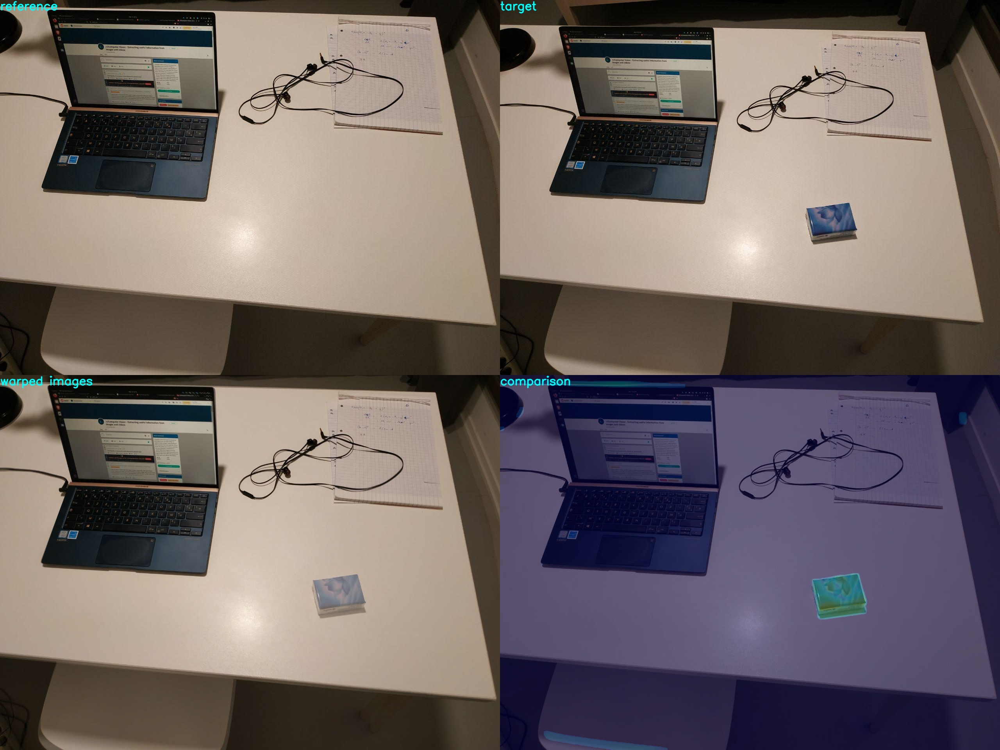

# imgcomp

This project aims at comparing two images of a same view (the images must be related by a homography) at different point in time. It uses only classical computer vision techniques such as feature detection / description / matching. It is robust to intensity variations.

## How to use it

Put the reference image and the target image in the `images/` folder. Then run

    python3 compare.py ref tar
    
The comparison image will be saved under `comparisons/`
